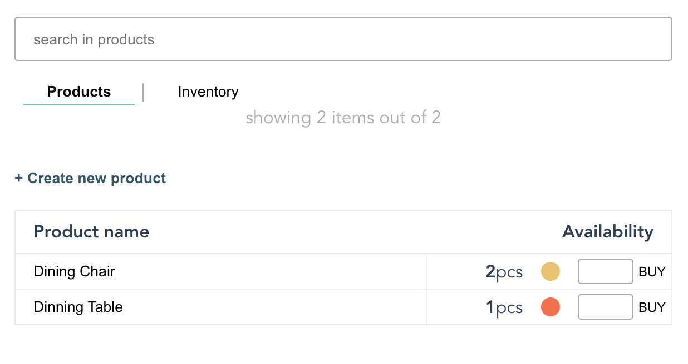

# Product management

### To do

- [ ] use websocket to poll inventory changes
- [ ] log server
- [ ] authentication
- [ ] error handling
- [x] **client side** add new inventory article
- [x] **client side** update article stock
- [x] **client side** fix types
- [x] **client side** add create product based on the inventory
- [x] **client side** buy product
- [x] endpoints product availability:
    - [x] get all products detail and availability: `/availability`
    - [x] get product details and availability by partial name: `/availability/:partial name`
- [x] endpoint for getting inventory article by partial name: `/inventory/:partialArticleName`
- [x] endpoint for getting inventory article by id: `/inventory/id/:articleId`
- [x] endpoint for getting all inventory: `/inventory`
- [x] **POST** endpoint for updating article in inventory: `inventory/update?art_id=articleId&stock=number`
- [x] **POST** endpoint for creating and adding a new article to inventory: `inventory/create?name=articleName&stock=number`
- [x] **POST** endpoint for creating and adding a new product: `products/create-product`
- [x] **POST** endpoint for buying a product: `/products/buy?product=productName&amount=number`
- [x] endpoint for getting specific product: `/products/:partialProductName`
- [x] endpoint for getting all products: `/products`
- [x] DB handler
- [x] create types
- [x] setup routing
- [x] setup node/express backend